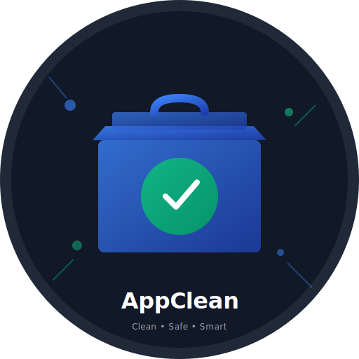

<div align="center">
  

  # AppClean

  > **Intelligently find and safely uninstall applications with all their artifacts**

  [](https://github.com/praveenkay/AppClean/releases)
  [](LICENSE)
  [](README.md)
  [](https://npmjs.com/package/appclean)

  **A powerful, cross-platform CLI tool for developers and system administrators**

</div>

## ✨ Features

- **🔍 Smart Detection** — Finds apps installed via npm, yarn, pnpm, Homebrew, apt, yum, dnf, and custom installers
- **📊 Deep Analysis** — Shows installation method, version, and locates all related artifacts
- **🛡️ Safe Removal** — Dry-run preview, double confirmation, and optional backups
- **💾 Backup & Restore** — Create backups before deletion and restore if needed
- **⚡ Fast & Efficient** — Scans and analyzes systems in seconds
- **🖥️ Cross-Platform** — macOS (Intel & Apple Silicon), Linux, and Windows
- **🎨 Beautiful CLI** — Interactive menu-driven interface with colors and animations

## 🚀 Installation

### Quick Install (npm)

```bash
npm install -g appclean
```

### From Source

```bash
git clone https://github.com/praveenkay/AppClean.git
cd AppClean
npm install
npm run build
npm install -g .
```

**Requirements:** Node.js 16+ and npm 7+

## 💻 Usage

### Interactive Mode

Simply run:

```bash
appclean
```

Then use arrow keys to navigate and select actions:
- 🔍 Search for applications
- 📋 List all installed apps
- 📊 View app details and artifacts
- 🗑️ Remove applications safely

### Command Mode

```bash
# Search for an app
appclean search webpack

# List all applications
appclean list

# Analyze app artifacts before removal
appclean analyze webpack

# Preview removal (no files deleted)
appclean remove webpack --dry-run

# Remove with backup
appclean remove webpack --backup

# Remove without confirmations
appclean remove webpack --force
```

## Supported Package Managers

| Manager | Platform | Support |
|---------|----------|---------|
| npm | All | ✅ |
| yarn | All | ✅ |
| pnpm | All | ✅ |
| Homebrew | macOS, Linux | ✅ |
| apt | Linux | ✅ |
| yum | Linux | ✅ |
| dnf | Linux | ✅ |
| Custom Scripts | All | ✅ |

## How It Works

AppClean intelligently detects and removes applications by:

1. **Scanning Installation Locations**
   - Checks npm/yarn/pnpm global directories
   - Queries Homebrew installation database
   - Searches Linux package manager databases
   - Scans custom binary locations

2. **Locating Related Files**
   - Configuration files (`~/.config`, `~/.bashrc`, etc.)
   - Cache directories
   - Data files and logs
   - Service files (systemd, LaunchAgents, etc.)

3. **Safe Removal**
   - Preview all files to be removed with `--dry-run`
   - Create optional backups before deletion
   - Double confirmation before final removal
   - Detailed error reporting

## 📚 Examples

### Interactive Search and Remove

```bash
$ appclean search webpack
ℹ Found 1 app(s)

? Select an app to remove: (Use arrow keys)
❯ webpack (npm) - v5.89.0

? What would you like to do? (Use arrow keys)
❯ 📊 View details and artifacts
  🗑️  Remove this app
  ⬅️  Back to search
```

### Preview Before Removal

```bash
$ appclean remove webpack --dry-run

ℹ Files to be removed:
  binary   512 B    /usr/local/bin/webpack
  config   1.2 KB   ~/.config/webpack
  cache    15 MB    ~/.cache/webpack
  data     2.3 MB   ~/.local/share/webpack
  log      512 B    ~/.local/share/log/webpack

ℹ Total space to be freed: 17.5 MB

✓ This is a preview only. No files were removed.
```

### Safe Removal with Backup

```bash
$ appclean remove webpack --backup

ℹ App: webpack
ℹ Method: npm
ℹ Version: 5.89.0

? This action cannot be undone. Remove webpack and all its files? (y/N) y

✓ Backup created: ~/.appclean-backups/webpack-2024-01-20T15-30-45.tar.gz
✓ Successfully removed webpack (freed 17.5 MB)
```

### List All Installed Apps

```bash
$ appclean list
ℹ Found 42 app(s)

┌──────────────┬──────────┬──────────┐
│     Name     │ Version  │ Method   │
├──────────────┼──────────┼──────────┤
│ webpack      │ 5.89.0   │ npm      │
│ typescript   │ 5.3.3    │ npm      │
│ lodash       │ 4.17.21  │ npm      │
│ node         │ 20.10.0  │ custom   │
│ git          │ 2.43.0   │ brew     │
│ python       │ 3.11.7   │ system   │
└──────────────┴──────────┴──────────┘
```

## Options

```
Usage: appclean [command] [options]

Commands:
  search <query>        Search for installed applications
  list                  List all installed applications
  analyze <appName>     Analyze an application and show its artifacts
  remove <appName>      Remove an application
  help                  Show help

Options:
  --dry-run             Preview without removing files
  --backup              Create backup before removal
  --force               Skip confirmation prompts
  --help                Show help information
  --version             Show version information
```

## Safety Features

⚠️ **AppClean prioritizes safety**:

- **Dry-run by default**: Use `--dry-run` to preview what will be deleted
- **Double confirmation**: You'll be asked to confirm twice before actual removal
- **Backups**: Create optional backups before removing apps
- **Detailed logging**: See exactly what's being removed
- **Error reporting**: Clear error messages if something goes wrong

## Platform-Specific Notes

### macOS
- Detects both Intel and Apple Silicon installations
- Removes LaunchAgents and LaunchDaemons
- Cleans Application Support directories
- Handles .plist preference files

### Linux
- Supports apt, yum, and dnf package managers
- Removes systemd service files
- Cleans .config and .local directories
- Handles /var/log files

### Windows
- Scans Program Files directories
- Removes APPDATA and LOCALAPPDATA entries
- Handles .exe files and shortcuts

## Troubleshooting

### App not found

```bash
appclean search partial-name
```

Try searching with a partial name. AppClean searches by substring.

### Permission denied

Some system files may require elevated permissions:

```bash
sudo appclean remove app-name
```

### Can't restore backup

Backups are stored in `~/.appclean-backups/`:

```bash
ls ~/.appclean-backups/
tar -xzf ~/.appclean-backups/app-backup.tar.gz
```

## Development

### Setup

```bash
git clone https://github.com/YOUR_USERNAME/appclean.git
cd appclean
npm install
```

### Build

```bash
npm run build
```

### Development Server

```bash
npm run dev
```

### Run Tests

```bash
npm test
```

## Contributing

Contributions are welcome! Please:

1. Fork the repository
2. Create a feature branch (`git checkout -b feature/amazing-feature`)
3. Commit your changes (`git commit -m 'Add amazing feature'`)
4. Push to the branch (`git push origin feature/amazing-feature`)
5. Open a Pull Request

## Roadmap

- [ ] GUI application
- [ ] Duplicate file finder
- [ ] Orphaned dependency detection
- [ ] Plugin system for custom detectors
- [ ] Scheduled cleanup automation
- [ ] App update checker
- [ ] Performance optimization for large scans

## Known Limitations

- System packages may require elevated permissions to remove
- Some service files may need manual cleanup
- Snap packages (Linux) are currently not supported

## License

MIT License © 2024

## Disclaimer

⚠️ **Use with caution**: This tool permanently deletes files. Always use `--dry-run` first to preview changes.

## 🤝 Support & Community

- **🐛 [Report Issues](https://github.com/praveenkay/AppClean/issues)** — Found a bug? Let us know
- **💬 [Discussions](https://github.com/praveenkay/AppClean/discussions)** — Share ideas and feedback
- **⭐ [Star on GitHub](https://github.com/praveenkay/AppClean)** — Show your support

## 📄 License

MIT License © 2026 [Praveen Kothapally](https://github.com/praveenkay)

---

**Built with care for developers and system administrators who value clean systems**

<div align="center">
  Made with ❤️ by <a href="https://github.com/praveenkay">Praveen Kothapally</a>
</div>
